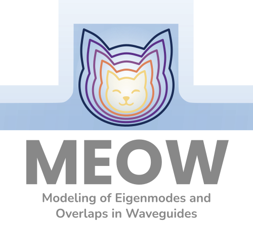

# MEOW (0.15.0)

> **M**odeling of **E**igenmodes and **O**verlaps in **W**aveguides

[](https://badge.fury.io/py/meow-sim)




A simple electromagnetic [EigenMode Expansion (EME)](https://en.wikipedia.org/wiki/Eigenmode_expansion) tool for Python.

## Highlights

- **EME** with parallel / slurm-distributed S-matrix and spectrum solves
  (`compute_s_matrix_parallel`, `compute_s_matrix_spectrum` with frequency
  distribution via `wls_per_job` and a parallel cascade via `cascade_workers`).
- **Material models** from [RefractiveIndex.INFO](https://refractiveindex.info)
  coupled to Sellmeier fitting (`meow.ridb`), including anisotropic and
  temperature-dependent dispersion.
- **Modal gradients & autodiff**: an exact effective-index adjoint
  (`meow.neff_gradient`, `neff_value_and_grad`), `jax.custom_vjp` plumbing
  (`make_differentiable_neffs`) so `jax.grad` flows through the solve into the
  JAX/SAX cascade, and a differentiable level-set/density path for inverse design
  (`meow.levelset`).
- **HPC knobs**: solver thread-pinning (`meow.limit_threads`,
  `MEOW_SOLVER_THREADS`), cached wavelength-independent subpixel smoothing, and a
  sparse shift-invert solver for very large grids (`meow.fde.sparse`). See the
  [HPC & gradients guide](https://gdsfactory.github.io/meow/hpc/).

## Installation

### Minimal installation
```sh
pip install meow-sim
```

### Full installation
```sh
pip install meow-sim[full]
```

This will include [gdsfactory](https://github.com/gdsfactory/gdsfactory) dependencies.


## Documentation

The documentation is available at
[gdsfactory.github.io/meow](https://gdsfactory.github.io/meow/).


## Contributors

- [@flaport](https://github.com/flaport): creator of MEOW
- [@jan-david-fischbach](https://github.com/jan-david-fischbach): fixing mode overlaps and more

## Credits

- [Tidy3D](https://github.com/flexcompute/tidy3d): meow uses the free FDE mode solver from Tidy3D.
- [SAX](https://github.com/flaport/sax): meow uses SAX as its circuit simulator when cascading the overlap S-matrices.
- [klujax](https://github.com/flaport/sax): Although technically an optional backend for SAX, klujax will significantly speed up the final S-matrix calculation of your structures.
- [EMEPy](https://github.com/BYUCamachoLab/emepy): an excellent alternative python-based EME solver with optional neural network mode solver.
- [Rigorous and efficient modeling of wavelength scale photonic components](http://photonics.intec.ugent.be/download/phd_104.pdf): PhD thesis of Peter Bienstman.
